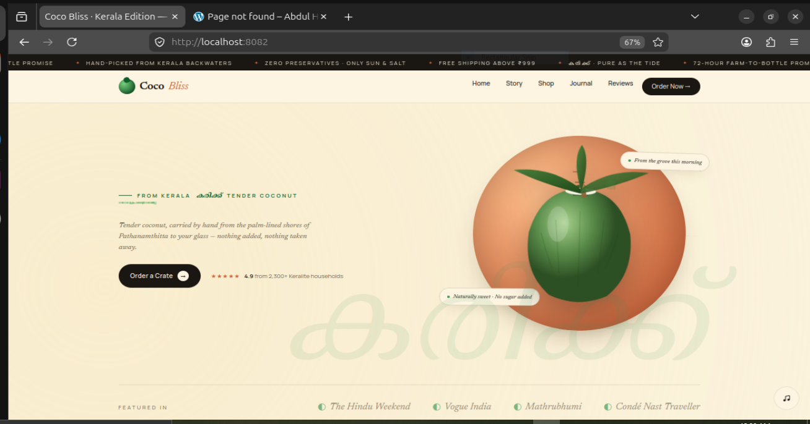
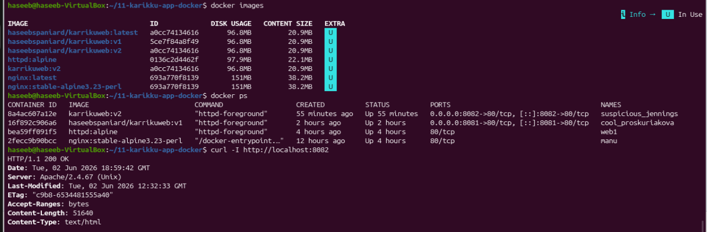
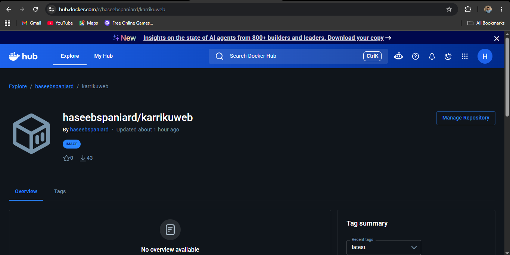
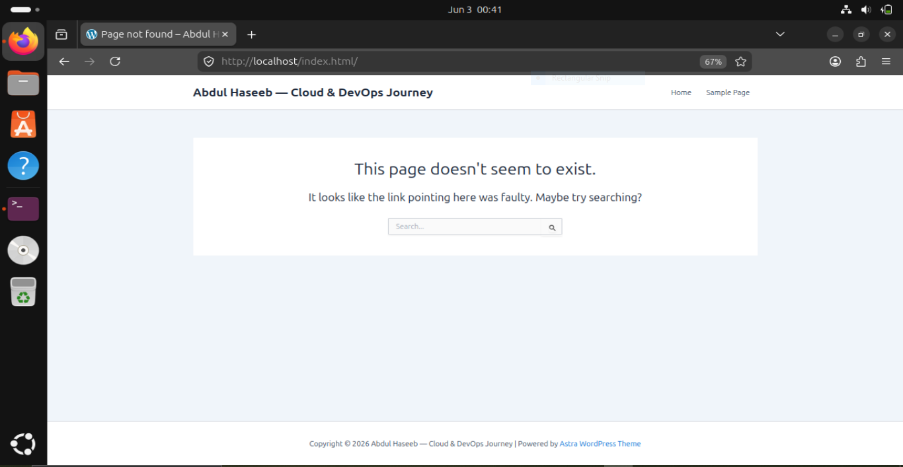

# Dockerizing a Static Website with Apache HTTPD

> Containerizing the **Karikku** static website using Docker and Apache (`httpd:alpine`), pushing to Docker Hub, and running it as a production-ready container.

---

## Project Overview

This project demonstrates how to take a plain HTML website, containerize it using Docker with an Apache web server, and deploy it via Docker Hub — following a real-world DevOps workflow.

| Detail | Info |
|--------|------|
| **Base Image** | `httpd:alpine` |
| **Web Server** | Apache HTTP Server 2.4 |
| **Website** | Karikku — Kerala-themed static site |
| **Docker Hub** | [haseebspaniard/karrikuweb](https://hub.docker.com/r/haseebspaniard/karrikuweb) |
| **Platform** | Ubuntu Linux (VirtualBox) |

---

## Website Running in Container



*Coco Bliss Kerala Edition — served by Apache inside a Docker container at `localhost:8082`*

---

## Architecture

```
Local Machine
│
├── karriku_website/
│   └── index.html          ← Static website files
├── httpd.conf              ← Custom Apache config
└── Dockerfile              ← Build instructions
         │
         ▼
   Docker Build
         │
         ▼
   Docker Image (karrikuweb:v2)
         │
         ▼
   Docker Hub (haseebspaniard/karrikuweb:v2)
         │
         ▼
   Docker Container → Port 8082 → Browser
```

See [docs/architecture.md](docs/architecture.md) for full details.

---

## Project Structure

```
11-karikku-app-docker/
├── karriku_website/
│   └── index.html
├── httpd.conf
├── Dockerfile
└── docs/
    ├── architecture.md
    ├── dockerfile.md
    ├── workflow.md
    └── troubleshooting.md
```

---

## Dockerfile

```dockerfile
FROM httpd:alpine
COPY ./httpd.conf /usr/local/apache2/conf/httpd.conf
RUN rm -rf /usr/local/apache2/htdocs/*
COPY ./karriku_website/ /usr/local/apache2/htdocs/
CMD ["httpd-foreground"]
```

See [docs/dockerfile.md](docs/dockerfile.md) for line-by-line explanation.

---

## Workflow

### 1. Prepare the Website Files
```bash
mv "Coco Bliss - Kerala Edition.html" index.html
mkdir karriku_website
mv index.html karriku_website/
```

### 2. Extract Apache Config from Base Image
```bash
docker container run --name web1 --rm -d httpd:alpine
docker cp web1:/usr/local/apache2/conf/httpd.conf .
```

### 3. Build the Docker Image
```bash
docker image build -t karrikuweb:v2 .
```

### 4. Run the Container
```bash
docker run -d -p 8082:80 karrikuweb:v2
```

### 5. Verify — HTTP 200 OK 



*`docker images`, `docker ps`, and `curl -I` all showing the container is live and serving correctly*

### 6. Tag and Push to Docker Hub
```bash
docker tag karrikuweb:v2 haseebspaniard/karrikuweb:v2
docker push haseebspaniard/karrikuweb:v2

docker tag karrikuweb:v2 haseebspaniard/karrikuweb:latest
docker push haseebspaniard/karrikuweb:latest
```

### 7. Pull and Test from Docker Hub



*Image publicly available on Docker Hub — 43 pulls and counting*

```bash
docker rmi haseebspaniard/karrikuweb:v2
docker run -d -p 8083:80 haseebspaniard/karrikuweb:v2
```

See [docs/workflow.md](docs/workflow.md) for the full step-by-step breakdown.

---

## Troubleshooting

Ran into errors during this project? So did I. One of the key issues was a broken `v1` image where `index.html` was accidentally a directory — causing Apache to issue a 301 redirect that landed on a completely different WordPress site:



*The 301 redirect from the broken container landing on the local WordPress site*

See [docs/troubleshooting.md](docs/troubleshooting.md) for all issues faced and how they were resolved.

---

## Docker Hub

The image is publicly available:

```bash
docker pull haseebspaniard/karrikuweb:v2
docker run -d -p 8080:80 haseebspaniard/karrikuweb:v2
```

[hub.docker.com/r/haseebspaniard/karrikuweb](https://hub.docker.com/r/haseebspaniard/karrikuweb)

---

## Tech Stack


---

## Author

**Abdul Haseeb**
Cloud & DevOps Learner | Former CS Teacher (3.5 years)

[LinkedIn](https://www.linkedin.com/in/abdulhaseebas)
[GitHub](https://github.com/haseebspaniard)
[Medium](https://medium.com/@haseebabdul480)
